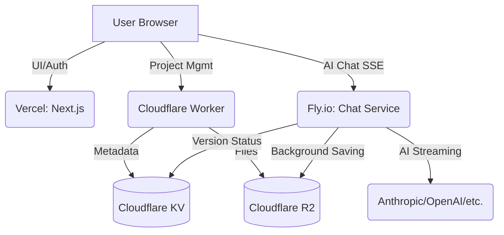

# Deployment Guide

This project consists of three main components, each deployed to a different platform optimized for its specific needs.

## 1. Frontend: Next.js (Vercel)

The frontend is a standard Next.js application that handles the user interface, authentication (Clerk), and project management via the Cloudflare Worker.

### Deployment Steps:
1. Ensure you have the [Vercel CLI](https://vercel.com/docs/cli) installed: `npm install -g vercel`.
2. From the project root, run:
   ```bash
   vercel --prod
   ```
3. Ensure the following environment variables are set in your Vercel project:
   - `NEXT_PUBLIC_CLERK_PUBLISHABLE_KEY`
   - `CLERK_SECRET_KEY`
   - `NEXT_PUBLIC_WORKER_URL` (URL of your Cloudflare Worker)
   - `NEXT_PUBLIC_CHAT_URL` (URL of your Fly.io chat service)

---

## 2. Metadata & Auth: Cloudflare Worker

The worker handles project metadata, billing, and versioning. It uses Hono and Cloudflare KV/R2.

### Deployment Steps:
1. Navigate to the `worker/` directory:
   ```bash
   cd worker
   ```
2. Deploy using [Wrangler](https://developers.cloudflare.com/workers/wrangler/):
   ```bash
   npm run deploy
   ```
3. Ensure your `wrangler.jsonc` or `wrangler.toml` is correctly configured with your `KV` and `R2` bindings.

---

## 3. AI Generation: Fly.io

The AI generation service is a Node.js application running on Fly.io. It is responsible for long-running AI streaming processes that need to be "refresh-safe" (continue in the background even if the user disconnects).

### Deployment Steps:
1. Navigate to the `fly-chat/` directory:
   ```bash
   cd fly-chat
   ```
2. Ensure you have the [Fly CLI](https://fly.io/docs/hands-on/install-flyctl/) installed.
3. Deploy the application:
   ```bash
   fly deploy
   ```
4. **Important**: The `fly-chat` service needs access to the same Cloudflare KV and R2 buckets as the worker. Ensure these environment variables are set on Fly.io using `fly secrets set`:
   - `CF_ACCOUNT_ID`
   - `CF_KV_NAMESPACE_ID`
   - `CF_API_TOKEN` (with KV and R2 access)
   - `R2_ACCESS_KEY_ID`
   - `R2_SECRET_ACCESS_KEY`
   - `R2_BUCKET_NAME`
   - `CLERK_SECRET_KEY`
   - `FRONTEND_URL`

---

## Architecture Diagram



## Summary of URLs

- **Frontend**: `https://your-app.vercel.app`
- **Worker**: `https://worker.your-subdomain.workers.dev`
- **Chat Service**: `https://your-app-chat.fly.dev`
